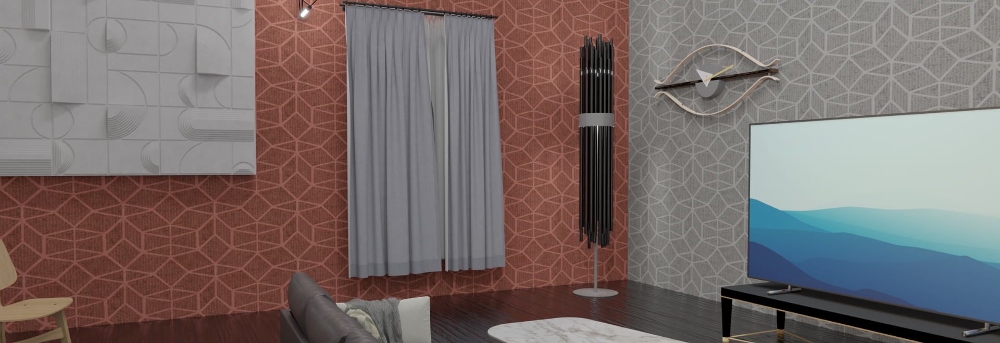

<h1 align="center">Hi👋I'm Khai Yuan</h1>
<h3 align="center">A maniacal developer from Malaysia</h3>




<div size='20px'>I'm Yap Khai Yuan. Thank you for taking the time to view my GitHub Profile. 
</div>

***
<h3 align="left">My socials:</h3>
<p align="left">
 
 
<a href="https://www.youtube.com/c/simply software" target="blank"></a>
</p>

***  


## My profile card

```sh
npx yuanyap
```
***

## 📷 Latest YouTube Videos
<!-- YOUTUBE:START -->
- [Best Camera and Equipment for YouTube/Content Creation Beginners | Feat. Unreal Devon Wood](https://www.youtube.com/watch?v=h4kXbEsj5o8)
- [Windows 11 First Look: Minimal, beautiful and awesome.](https://www.youtube.com/watch?v=VHzDgxr8N8I)
- [White iPhone 12 Impressions and Review: Fast](https://www.youtube.com/watch?v=NqdV04HG3xQ)
- [DaVinci Resolve 17 - Editing Your First Video #2](https://www.youtube.com/watch?v=_EUVaj44-t0)
- [DaVinci Resolve 17 - BEST FREE Editing Software for Windows & Mac #1](https://www.youtube.com/watch?v=aZYmYq7Po1U)
<!-- YOUTUBE:END -->

***
<h2 align="left" id="yapkhaiyuan">Favorite Tech</h2>

> Tools, languages, and other things that I like to work with.

<table>
  <tr>
    <td align="center" width="96">
      <a href="#yapkhaichuen">
        
      </a>
      <br>Electron
    </td>
    <td align="center" width="96">
      <a href="#yapkhaichuen">
        
      </a>
      <br>Python
    </td>
    <td align="center" width="96">
      <a href="#yapkhaichuen">
        
      </a>
      <br>Bootstrap
    </td>
    <td align="center" width="96">
      <a href="#yapkhaichuen">
        
      </a>
      <br>CSS3
    </td>
    <td align="center" width="96">
      <a href="#yapkhaichuen">
        
      </a>
      <br>TypeScript
    </td>
    <td align="center" width="96">
      <a href="#yapkhaichuen">
        
      </a>
      <br>JavaScript
    </td>
    <td align="center" width="96">
      <a href="#yapkhaichuen" >
        
      </a>
      <br>React
    </td>
    <td align="center" width="96">
      <a href="#yapkhaichuen">
        
      </a>
      <br>Git
    </td>
    <td align="center" width="96">
      <a href="#yapkhaichuen">
        
      </a>
      <br>Sass
    </td>
  </tr>
  <tr>
    <td align="center" width="96"> 
      <a href="#yapkhaichuen" >
        
      </a>
      <br>jQuery
    </td>
    <td align="center" width="96">
      <a href="#yapkhaichuen" >
        
      </a>
      <br>Heroku
    </td>
    <td align="center"  width="96">
      <a href="#yapkhaichuen">
        
      </a>
      <br>Node
    </td>
    <td align="center"  width="96">
      <a href="#yapkhaichuen">
        
      </a>
      <br>HTML5
    </td>
    <td align="center" width="96">
      <a href="#yapkhaichuen">
        
      </a>
      <br>Vue
    </td>
    <td align="center"  width="96">
      <a href="#yapkhaichuen">
        
      </a>
      <br>MySQL
    </td>
    <td align="center" width="96">
      <a href="#yapkhaichuen" >
        
      </a>
      <br>VS Code
    </td>
    <td align="center" width="96">
      <a href="#yapkhaichuen" >
        
      </a>
      <br>NPM
    </td>
    <td align="center" width="96">
      <a href="#yapkhaichuen" >
        
      </a>
      <br>Terminal
    </td>
  </tr>
</table>


***


## GitHub Stats


<p></p>

<p></p>

***


<details>
     <br/>
<summary>Time spent on coding this week</summary>
     


<!--START_SECTION:waka-->


**🐱 My Github Data** 

> 🏆 2,850 Contributions in the Year 2021
 > 
> 📦 17.0 kB Used in Github's Storage 
 > 
> 🚫 Not Opted to Hire
 > 
> 📜 6 Public Repositories 
 > 
> 🔑 0 Private Repositories  
 > 
**I'm an Early 🐤** 

```text
🌞 Morning    25 commits     ██░░░░░░░░░░░░░░░░░░░░░░░   10.04% 
🌆 Daytime    148 commits    ██████████████░░░░░░░░░░░   59.44% 
🌃 Evening    76 commits     ███████░░░░░░░░░░░░░░░░░░   30.52% 
🌙 Night      0 commits      ░░░░░░░░░░░░░░░░░░░░░░░░░   0.0%

```
📅 **I'm Most Productive on Sunday** 

```text
Monday       57 commits     █████░░░░░░░░░░░░░░░░░░░░   22.89% 
Tuesday      20 commits     ██░░░░░░░░░░░░░░░░░░░░░░░   8.03% 
Wednesday    38 commits     ███░░░░░░░░░░░░░░░░░░░░░░   15.26% 
Thursday     19 commits     ██░░░░░░░░░░░░░░░░░░░░░░░   7.63% 
Friday       23 commits     ██░░░░░░░░░░░░░░░░░░░░░░░   9.24% 
Saturday     18 commits     █░░░░░░░░░░░░░░░░░░░░░░░░   7.23% 
Sunday       74 commits     ███████░░░░░░░░░░░░░░░░░░   29.72%

```


📊 **This Week I Spent My Time On** 

```text
⌚︎ Time Zone: Asia/Kuala_Lumpur

💬 Programming Languages: 
JavaScript               1 hr 21 mins        ██████████████░░░░░░░░░░░   56.7% 
Markdown                 21 mins             ███░░░░░░░░░░░░░░░░░░░░░░   14.76% 
HTML                     15 mins             ██░░░░░░░░░░░░░░░░░░░░░░░   10.69% 
JSON                     13 mins             ██░░░░░░░░░░░░░░░░░░░░░░░   9.52% 
Python                   5 mins              █░░░░░░░░░░░░░░░░░░░░░░░░   3.9%

🔥 Editors: 
VS Code                  2 hrs 24 mins       █████████████████████████   100.0%

🐱‍💻 Projects: 
Unknown Project          1 hr 10 mins        ████████████░░░░░░░░░░░░░   48.73% 
Dark Mode                29 mins             █████░░░░░░░░░░░░░░░░░░░░   20.12% 
Node.js-Chat-App         19 mins             ███░░░░░░░░░░░░░░░░░░░░░░   13.66% 
YuanYap Card             16 mins             ███░░░░░░░░░░░░░░░░░░░░░░   11.75% 
wakatime.vscode-wakatime-6 mins              █░░░░░░░░░░░░░░░░░░░░░░░░   4.21%

💻 Operating System: 
Windows                  2 hrs 24 mins       █████████████████████████   100.0%

```

**I Mostly Code in HTML** 

```text
HTML                     2 repos             ██████████░░░░░░░░░░░░░░░   40.0% 
JavaScript               2 repos             ██████████░░░░░░░░░░░░░░░   40.0% 
Brainfuck                1 repo              █████░░░░░░░░░░░░░░░░░░░░   20.0%

```


**Timeline**

 


 Last Updated on 07/09/2021
<!--END_SECTION:waka-->


 <br/>

</details>


